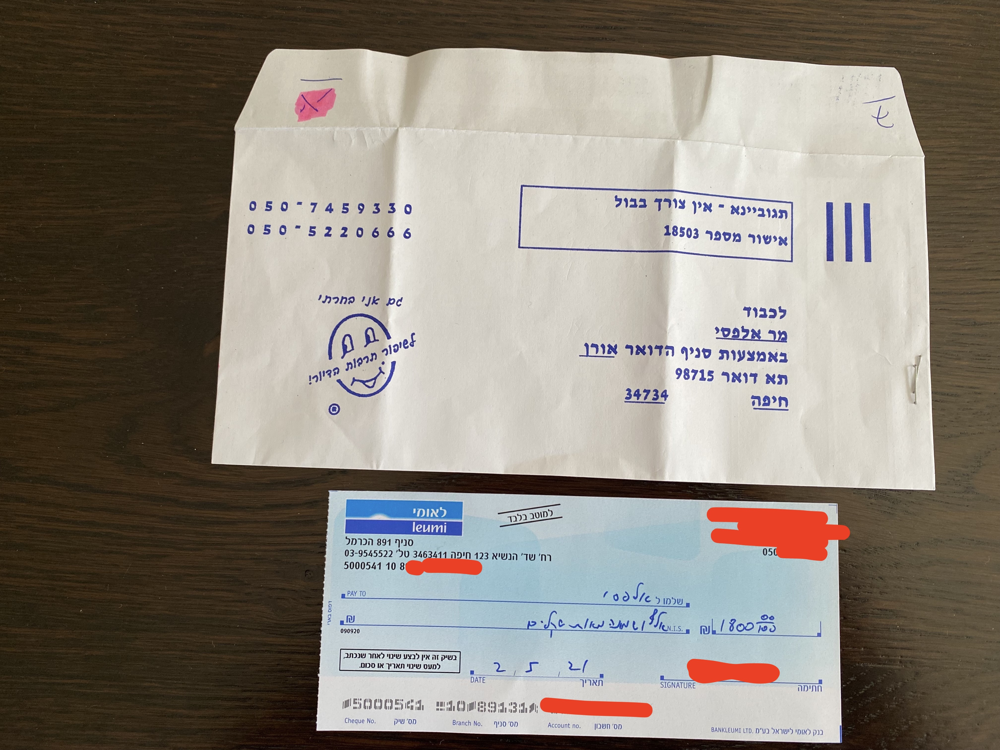
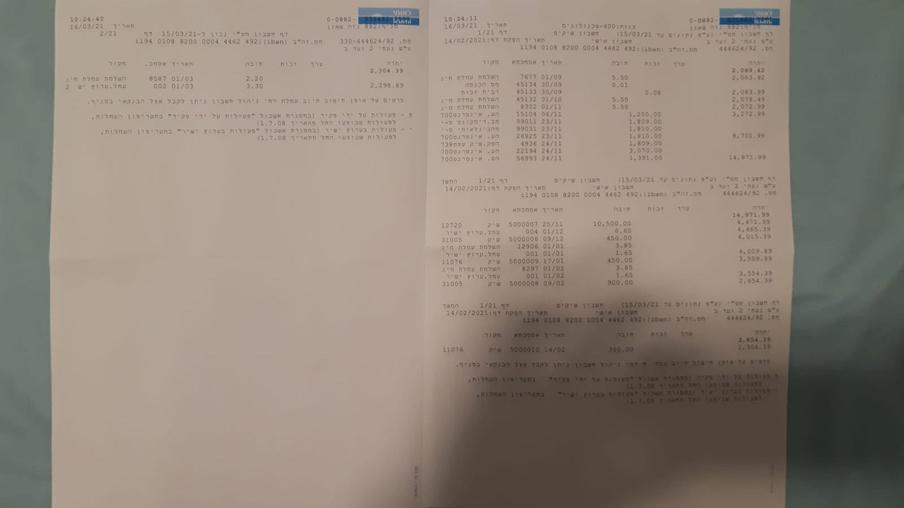

# Naomi 2 Haifa Finances

We will manage the building finances using this page, which is publicly accessible.

# Notices

### May 2, 2021

Collected money from everybody but two apartments.

# Balance

Starting Balance: 2293.39 ILS transferred from Adam Yaron on April 2, 2021.

| Date | Action | Remaining Balance| Comments|
|-------|--------|-------|-------|
| April 2, 2021 | +2293.39 | 2293.39 | transfer from previous VAAD Adam Yaron|
| April 7, 2021 | -700 | 1593.39 | paid gardener for cleaning the garden today |
| April 7, 2021 | +1200 | 2793.39 | deposit by Yaron Kanter |
| April 7, 2021 | +1200 | 3993.39 | deposit by Amit Adam |
| April 23, 2021 | +1000 | 4993.39 | deposit by Adam Yaron, deducting 200 shekel for electricity he paid |
| April 28, 2021 | -141 | 4852.39 | electricity bill (4 months) |
| May 2, 2021 | +1200 | 6052.39 | deposit by Maya+Oded Strauss|
| May 3, 2021 | -1800 | 4252.39 | cleaning payment Jan-Apr 2021 |

# Documents

## Cleaning end of service, and payment for final bills

## Cleaning receipts Nov 20 to April 21

## Receipt for electricity bill payment April 2021

## Electricity bill April 2021

# Documents from previous VAAD

## Image 1 from Yaron Kanter upon closing of previous VAAD bank account:

## Image from Adam Yaron regarding payments for 2020:

